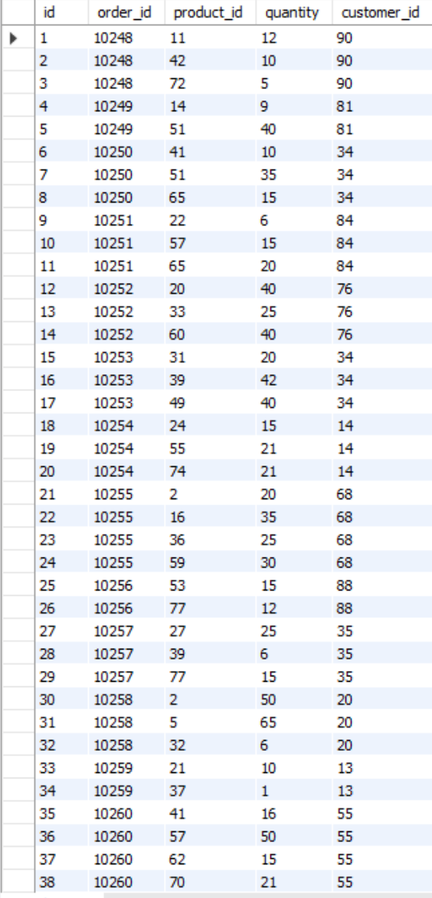
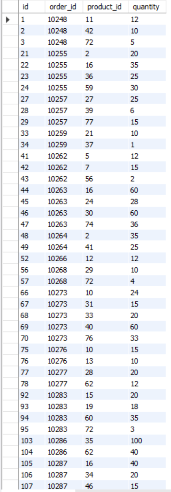
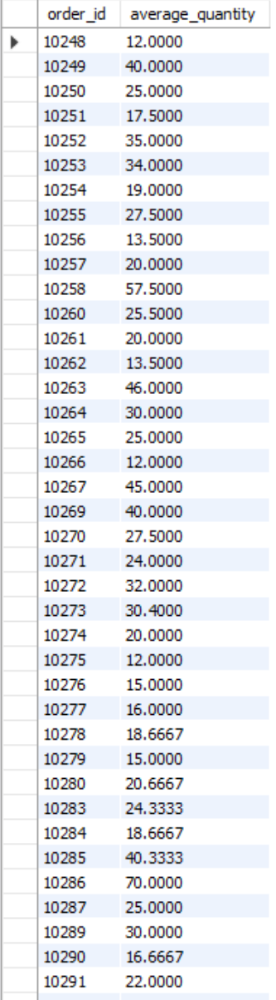
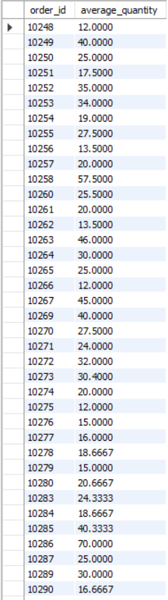
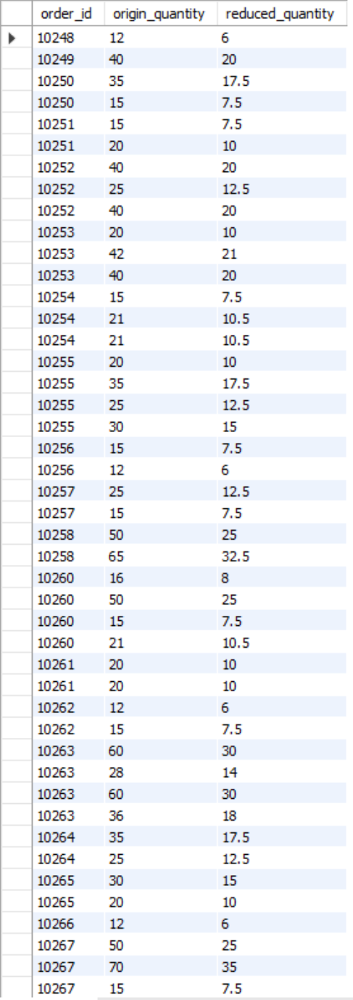

# DML and DDL commands (HW3)

## Content

- [Task1](#Task1)
- [Task2](#Task2)
- [Task3](#Task3)
- [Task4](#Task4)
- [Task5](#Task5)

## Task1

Write an SQL query that will display the order_details table and the customer_id field from the orders table, respectively, for each record field from the order_details table.

This must be done using a nested query in a SELECT statement.


SQL queries:

``` mysql 
    use hw2;

    SELECT 
        od.*,
        (SELECT o.customer_id
        FROM orders AS o
        WHERE o.id = od.order_id) AS customer_id
    FROM order_details AS od;
```

Result:




## Task2

Write an SQL query that will display the order_details table. Filter the results so that the corresponding record from the orders table fulfills the condition shipper_id=3.

This must be done using a nested query in the WHERE clause.


SQL queries:

``` mysql 
    use hw2;

    SELECT 
        od.*
    FROM order_details AS od
    WHERE od.order_id IN (SELECT o.id 
                FROM orders AS o 
                WHERE o.shipper_id = 3);
```

Result:




## Task3

Write an SQL query nested in the FROM statement that will select rows with the condition quantity>10 from the order_details table. For the received data, find the average value of the quantity field - you should group by order_id.


SQL queries:

``` mysql 
    use hw2;

    SELECT 
        od.order_id,
        AVG(od.quantity) AS average_quantity
    FROM (SELECT order_id, quantity 
        FROM order_details 
        WHERE quantity > 10) AS od
    GROUP BY od.order_id;
```

Result:




## Task4

Solve Problem 3 by using the WITH statement to create the temporary table temp. If your version of MySQL is earlier than 8.0, create this query in the same way as it is done in the synopsis.


SQL queries:

``` mysql 
    use hw2;

    WITH TempTable AS (
        SELECT order_id, quantity
        FROM order_details
        WHERE quantity > 10
    )
    SELECT 
        od.order_id,
        AVG(od.quantity) AS average_quantity
    FROM TempTable as od
    GROUP BY od.order_id;
```

Result:




## Task4

Create a function with two parameters that will divide the first parameter by the second. Both the parameters and the return value must be of type FLOAT.

Use the DROP FUNCTION IF EXISTS construct. Apply the function to the quantity attribute of the order_details table. The second parameter can be any number you like.


SQL queries:

``` mysql 
    use hw2;

    DROP FUNCTION IF EXISTS ReduceValue;

    DELIMITER //

    CREATE FUNCTION ReduceValue(numerator FLOAT, denominator FLOAT)
    RETURNS FLOAT
    DETERMINISTIC
    NO SQL
    BEGIN
        RETURN IF(denominator > 0, numerator / denominator, numerator);
    END //

    DELIMITER ;


    WITH TempTable AS (
        SELECT order_id, quantity
        FROM order_details
        WHERE quantity > 10
    )
    SELECT 
        od.order_id,
        od.quantity as origin_quantity,
        ReduceValue(od.quantity, 2) AS reduced_quantity
    FROM TempTable as od;
```

Result:

